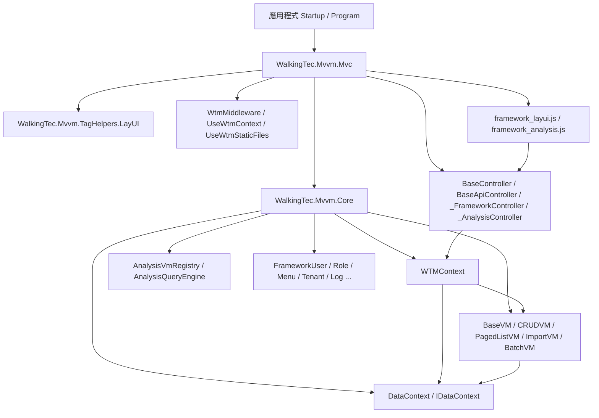
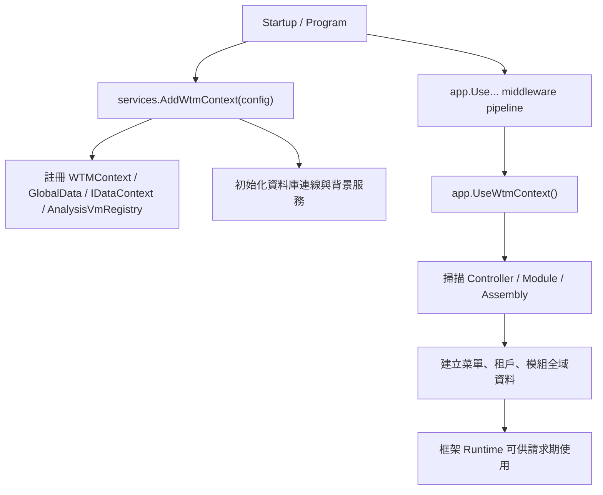
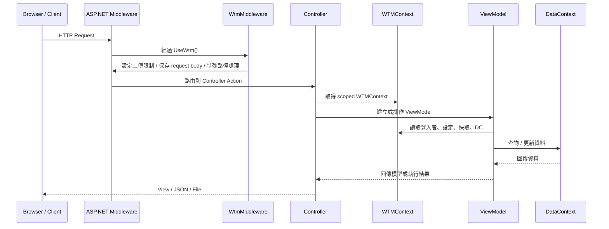
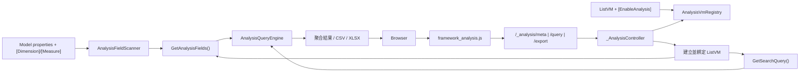

# WTM 系統架構導覽

本文件用來快速建立對 WalkingTec.Mvvm（WTM）的整體理解，重點放在：

- 專案分層與模組責任
- 啟動期如何完成框架接線
- 一般 MVC/API 請求如何流過 Controller、ViewModel、`WTMContext` 與 `DataContext`
- Analysis Mode 如何在既有 ListVM 上擴充分析能力

如果你要看 Analysis Mode 的 API、欄位標註與安全限制細節，請直接搭配 [docs/analysis-mode.md](/Users/openclaw/.openclaw/shared/projects/WTM/docs/analysis-mode.md) 一起讀。

---

## 1. WTM 是什麼

WTM 是一套基於 ASP.NET Core 8 的快速開發框架，核心設計不是只提供幾個 helper，而是把以下幾件事整合成一個完整開發模型：

- 統一的 ViewModel 模式
- 內建的後台管理能力
- 與前端 UI 的整合元件
- 代碼產生器
- 多資料庫、多租戶、權限、登入、日誌等基礎能力

框架把日常開發收斂到四種主要 ViewModel 類型：

- `BaseCRUDVM<T>`：單筆資料增刪改查
- `BasePagedListVM<TModel, TSearcher>`：清單查詢、分頁、匯出
- `BaseImportVM<T>` / `BaseTemplateVM<T>`：Excel 匯入
- `BaseBatchVM<T>`：批次操作

這些類型都繼承自 `BaseVM`，而 `BaseVM` 的關鍵依賴就是 `WTMContext`。

---

## 2. 核心模組分層

### 主要專案

| 專案 | 角色 |
|------|------|
| `src/WalkingTec.Mvvm.Core` | 核心框架，包含 ViewModel、`WTMContext`、`DataContext`、模型與分析引擎 |
| `src/WalkingTec.Mvvm.Mvc` | MVC / API Controller、啟動擴充、中介層、內嵌 JS/靜態資源 |
| `src/WalkingTec.Mvvm.TagHelpers.LayUI` | LayUI 專用 TagHelpers 與 UI 元件 |

### 架構圖



### 理解重點

- `Core` 是業務執行模型所在，`Mvc` 是 HTTP 接線與 Web 輸出所在
- `WTMContext` 是框架的執行時中心，連接 HTTP、登入者、快取、資料庫、Session、Localizer 等資訊
- `BaseVM` 是 ViewModel 共同基底，讓各種 VM 都用一致方式取得上下文
- `TagHelpers.LayUI` 只是一種 UI 實作，並不改變核心 VM / Context 模型

---

## 3. 啟動期怎麼接線

WTM 的啟動分成兩件事：

1. `services.AddWtmContext(config)` 進行 DI 註冊與框架初始化
2. `app.UseWtmContext()` 在應用啟動後掃描模組、建立全域資料並完成框架 runtime 接線

### `AddWtmContext(config)` 做了什麼

根據 [src/WalkingTec.Mvvm.Mvc/Helper/FrameworkServiceExtension.cs](/Users/openclaw/.openclaw/shared/projects/WTM/src/WalkingTec.Mvvm.Mvc/Helper/FrameworkServiceExtension.cs)，這個方法會完成以下核心工作：

- 註冊 `HttpContextAccessor`
- 註冊 `GlobalData`
- 註冊 `WTMContext` 為 scoped
- 註冊 `IDataContext` 預設實作
- 設定表單與上傳限制
- 註冊背景服務，例如 Quartz 與 DB warmup
- 建立 `AnalysisVmRegistry`，啟動時掃描所有程序集中的 Analysis ListVM
- 嘗試初始化可用資料庫連線
- 接好 API versioning 等 Web 支援能力

### `UseWtmContext()` 做了什麼

它不是單純中介層，而是框架啟動後的第二段初始化：

- 設定本地化使用的 `Program` localizer
- 掃描所有 Controller 與 Module
- 判斷目前是否為 SPA 模式
- 建立菜單快取取得函式
- 建立租戶清單取得函式
- 推導全域模組結構，供權限、菜單與後台能力使用

### 啟動期流程圖



---

## 4. `WTMContext` 是整個框架的執行時核心

`WTMContext` 可以把它理解成「每個 request 的框架工作上下文」。它本身持有或延遲取得：

- `HttpContext`
- `ServiceProvider`
- `ConfigInfo`
- `GlobalData`
- `IDataContext DC`
- `LoginUserInfo`
- `Session`
- `IModelStateService`
- `IUIService`
- `IDistributedCache`
- `IStringLocalizer`

### 它的重要性在哪裡

Controller 跟 ViewModel 不直接自己去組裝這些相依，而是統一透過 `WTMContext` 取得。這讓框架可以把：

- 目前登入者
- 目前資料庫連線
- 目前租戶
- 視窗 / Dialog 狀態
- 本地化與快取

全部綁在同一個執行脈絡中。

### `BaseVM` 如何使用 `WTMContext`

`BaseVM` 有一個核心屬性：

```csharp
public WTMContext Wtm { get; set; }
```

然後再把常用能力投影成快捷屬性，例如：

- `DC`
- `LoginUserInfo`
- `ConfigInfo`
- `Session`
- `MSD`
- `Localizer`
- `UIService`

所以大多數 VM 不需要直接解 DI，就能取得資料庫與執行環境。

---

## 5. 一般請求是怎麼流動的

WTM 下，一般 MVC/API 請求的核心路徑大致如下：



### 這段流程裡各自負責什麼

#### `WtmMiddleware`

根據 [src/WalkingTec.Mvvm.Mvc/Helper/WtmMiddleware.cs](/Users/openclaw/.openclaw/shared/projects/WTM/src/WalkingTec.Mvvm.Mvc/Helper/WtmMiddleware.cs)，它主要做的是框架層級請求預處理：

- 設定最大 request body size
- 特殊處理工作流路由
- 在首頁寫入 `pagemode` / `tabmode` cookie
- 對非表單 request 先讀取並緩存 body
- 對 404 回應寫空字串

它不是業務中介層，而是 WTM 的 Web 執行環境修飾器。

#### `BaseController` / `BaseApiController`

所有應用 Controller 都繼承這兩個類別之一，並共用 `WTMContext Wtm`。這表示 Controller 不需自己重做以下事情：

- 取 `IDataContext`
- 取快取
- 取目前使用者
- 取設定
- 取多語系資源

#### ViewModel

WTM 的主邏輯不是塞在 Controller，而是盡量收斂在 VM。一般來說：

- Controller 負責接 HTTP
- VM 負責查詢、驗證、資料轉換、頁面狀態
- `DataContext` 負責 EF Core / DB 互動

這是這套系統最重要的設計習慣。

---

## 6. 四種 ViewModel 的角色分工

| 類型 | 用途 | 常見場景 |
|------|------|----------|
| `BaseCRUDVM<T>` | 單筆新增、編輯、刪除 | 表單頁、詳細頁、編輯頁 |
| `BasePagedListVM<TModel, TSearcher>` | 清單查詢、分頁、匯出 | 後台列表、查詢頁 |
| `BaseImportVM<T>` / `BaseTemplateVM<T>` | 匯入範本與資料導入 | Excel 匯入 |
| `BaseBatchVM<T>` | 對多筆資料批次處理 | 批次審核、批次更新 |

### 實際理解方式

- `CRUDVM` 偏單筆資料生命週期
- `PagedListVM` 偏查詢與表格輸出
- `ImportVM` 偏資料導入流程
- `BatchVM` 偏多筆資料操作編排

如果你在看業務模組，先判斷它屬於哪種 VM，通常就能很快定位它的主責。

---

## 7. `DataContext` 與資料存取

WTM 的 `DataContext` 是 EF Core 的框架封裝，支援：

- SQL Server
- MySQL
- PostgreSQL
- SQLite
- Oracle

### 多租戶處理

多租戶是透過 EF Core global query filters 處理。實務上代表：

- 一般查詢會自動受到租戶條件影響
- 若要做跨租戶讀取，需要明確使用 `IgnoreQueryFilters()`

因此只要看到租戶相關問題，先檢查是不是被 query filter 影響，而不是先懷疑 Controller 或 VM 本身。

---

## 8. Analysis Mode 的位置與流程

Analysis Mode 是 WTM 中一個很有代表性的擴充：它不是獨立報表系統，而是把既有 `ListVM` 直接升級成臨時分析介面。

### 主要元件

| 元件 | 角色 |
|------|------|
| `[EnableAnalysis]` | 宣告某個 ListVM 可被分析 |
| `[Dimension]` / `[Measure]` | 標記可分析欄位 |
| `AnalysisVmRegistry` | 啟動時掃描白名單 VM |
| `AnalysisFieldScanner` | 反射產出欄位中繼資料 |
| `AnalysisQueryEngine` | 驗證、套用篩選、分組聚合 |
| `_AnalysisController` | 暴露 `/meta`、`/query`、`/export` API |
| `framework_analysis.js` | 前端切換與查詢 UI |

### Analysis Mode 流程圖



### 為什麼它重要

這一段很能代表 WTM 的設計取向：

- 安全靠白名單與欄位標註
- 查詢來源仍沿用原本 ListVM
- 分析功能是框架擴充，不是每個模組各寫一套

也就是說，WTM 的擴充方式偏向「在既有 VM 抽象上疊加能力」，不是另開平行架構。

---

## 9. Controller、VM、Context 三者的關係

很多新進入這個 repo 的人，最容易混淆的是「邏輯到底該放在哪裡」。

可用以下原則快速判斷：

### Controller

- 接 HTTP
- 做路由、回應型別、頁面進出點
- 不要承擔主要業務規則

### ViewModel

- 承接頁面或 API 的主要操作流程
- 組裝查詢條件
- 做驗證、資料處理、頁面狀態管理

### `WTMContext`

- 提供 request-scoped 執行環境
- 把 HTTP、登入者、快取、資料庫、Session、Localizer 等能力收斂到單一入口

### `DataContext`

- 真正與資料庫交互
- 承接 EF Core 行為與多租戶 query filter

這套分工如果抓穩，讀 WTM 代碼的速度會快很多。

---

## 10. 讀碼順序建議

如果你要真正進入這套系統，建議照這個順序讀：

1. [src/WalkingTec.Mvvm.Core/BaseVM.cs](/Users/openclaw/.openclaw/shared/projects/WTM/src/WalkingTec.Mvvm.Core/BaseVM.cs)
2. [src/WalkingTec.Mvvm.Core/WTMContext.cs](/Users/openclaw/.openclaw/shared/projects/WTM/src/WalkingTec.Mvvm.Core/WTMContext.cs)
3. [src/WalkingTec.Mvvm.Core/BasePagedListVM.cs](/Users/openclaw/.openclaw/shared/projects/WTM/src/WalkingTec.Mvvm.Core/BasePagedListVM.cs)
4. [src/WalkingTec.Mvvm.Mvc/BaseController.cs](/Users/openclaw/.openclaw/shared/projects/WTM/src/WalkingTec.Mvvm.Mvc/BaseController.cs)
5. [src/WalkingTec.Mvvm.Mvc/Helper/FrameworkServiceExtension.cs](/Users/openclaw/.openclaw/shared/projects/WTM/src/WalkingTec.Mvvm.Mvc/Helper/FrameworkServiceExtension.cs)
6. [src/WalkingTec.Mvvm.Mvc/Helper/WtmMiddleware.cs](/Users/openclaw/.openclaw/shared/projects/WTM/src/WalkingTec.Mvvm.Mvc/Helper/WtmMiddleware.cs)
7. [src/WalkingTec.Mvvm.Mvc/_AnalysisController.cs](/Users/openclaw/.openclaw/shared/projects/WTM/src/WalkingTec.Mvvm.Mvc/_AnalysisController.cs)
8. [docs/analysis-mode.md](/Users/openclaw/.openclaw/shared/projects/WTM/docs/analysis-mode.md)

---

## 11. 一句話總結

WTM 的核心不是「一堆 helper」，而是：

> 以 `WTMContext` 為執行時中心、以 `BaseVM` 為業務承載中心、以 MVC 與 TagHelpers 為輸出層的整體式快速開發框架。

理解這一點後，再看任何功能模組，通常都能很快判斷它是在：

- 接線層
- VM 層
- Context 層
- 資料層
- 或框架擴充層

